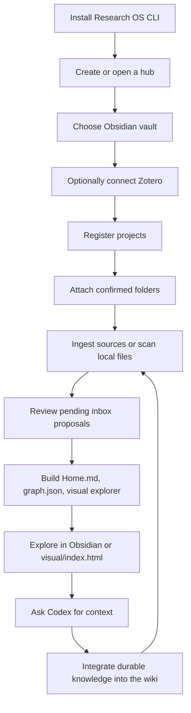

# Research OS

Research OS is a local-first indexing layer for scientific research. It coordinates existing project folders, Obsidian notes, Zotero metadata, PDFs, analysis outputs, and agent context without moving or owning the user's files.

Core model:

```text
project folders + Obsidian + Zotero + PDFs + outputs
        -> Research OS registries
        -> Home.md + graph.json + visual/index.html
        -> Codex can resolve research context
```

## Safety Rules

- Do not mutate Zotero records unless the user explicitly asks.
- Do not read or deep-process PDFs/full text unless the user explicitly confirms.
- Do not attach folders to projects from heuristic matches without confirmation.
- Preserve existing notes; append or update sections instead of wholesale rewrites.
- Prefer small visible CLI commands: `status`, `validate`, `doctor`, `build-index`, `build-graph`, `build-visual`, `context`, and `scan`.

## Install Research OS

When asked to install Research OS, first determine whether the user is in the source repo or installing from a checked-out repo path.

Recommended local development install:

```bash
python -m pip install -e .
research-os --help
```

Fallback without installation:

```bash
PYTHONPATH=src python -m research_os.cli --help
```

After installation, create a hub:

```bash
research-os init ~/ResearchOS
```

Then tell the user to open the hub folder in Codex and ask:

```text
Initialize my Research OS workspace.
```

## Agent-Driven Onboarding

Use this sequence when onboarding a hub. Ask concise questions, then run commands and report outcomes.

1. Confirm the hub path.
   - If no hub exists, run `research-os init <path>`.
   - If a hub exists, run `research-os status --hub <path>` and `research-os validate --hub <path>`.

2. Check configuration.
   - Read `research-os.yaml`.
   - Confirm the Obsidian vault path.
   - Ask whether the user wants to use an existing Obsidian vault or the starter vault.

3. Check integrations.
   - Ask whether Zotero Desktop should be checked.
   - If yes, run `research-os zotero-status`.
   - Treat Zotero as read-only by default.

4. Register project roots.
   - Ask which existing folders matter.
   - Create the first project with `research-os new-project <id> --title "<title>" --hub <path>`.
   - Attach confirmed folders with `research-os attach-folder <project-id> <folder> --kind <kind> --hub <path>`.

5. Add source context.
   - For Zotero collections, use `research-os ingest-zotero-collection <collection> --project <project-id> --hub <path>`.
   - For local files, run `research-os scan --hub <path>` first.
   - Only write proposals with `research-os scan --hub <path> --apply`.
   - Confirm one proposal at a time with `research-os confirm-proposal <proposal-id> --hub <path>`.

6. Build generated surfaces.
   - Run `research-os validate --hub <path>`.
   - Run `research-os build-index --hub <path>`.
   - Run `research-os build-graph --hub <path>`.
   - Run `research-os build-visual --hub <path>`.

7. Teach the user the cockpit.
   - `obsidian/starter-vault/Home.md` is the human project cockpit.
   - `graph/graph.json` is the machine-readable relationship graph.
   - `visual/index.html` is the static visual explorer.
   - `registries/projects.yaml`, `sources.yaml`, `files.yaml`, `relations.yaml`, and `inbox.yaml` are the control plane.

8. Verify agent context.
   - Run `research-os context <project-or-source-or-tag> --hub <path>`.
   - Explain that future questions should mention project ids, tags, papers, concepts, folders, or roles so agents can resolve through registries and graph.

## User Experience Flow

Use this flow to orient users:



## Common Commands

```bash
research-os status --hub <path>
research-os validate --hub <path>
research-os doctor --hub <path>
research-os new-project <project-id> --title "<title>" --hub <path>
research-os attach-folder <project-id> <folder> --kind analysis --hub <path>
research-os ingest-zotero-collection <collection> --project <project-id> --hub <path>
research-os scan --hub <path>
research-os scan --hub <path> --apply
research-os confirm-proposal <proposal-id> --hub <path>
research-os build-index --hub <path>
research-os build-graph --hub <path>
research-os build-visual --hub <path>
research-os context <query> --hub <path>
```
